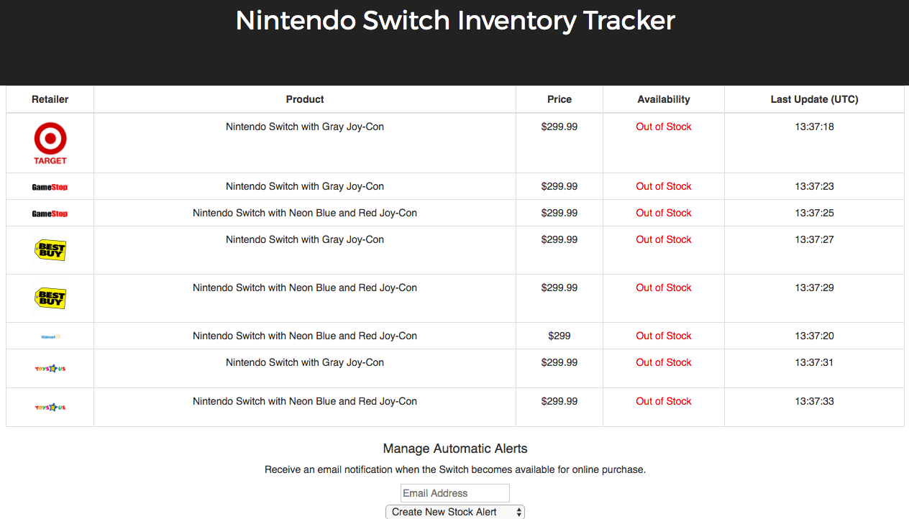

# Switch Inventory Tracker
---

## About
The Switch Inventory Tracker is a full-stack single-page web application for monitoring the availability of the hard 
to find Nintendo Switch console.  The app scrapes the online purchase availability of the Nintendo Switch from major
online video game retailers including Walmart, Target, GameStop, Best Buy, and Toys R Us.  Users who sign up for
automatic alerts will receive an instant email notification containing a purchase link when the Switch becomes available for online 
purchase.  Sign up for alerts today to get help securing your Switch!
<br><br>


## Author: Chad McKee
* <a href="https://github.com/chadm9">GitHub</a>
* <a href="http://wchadmckee.com/">Personal Website</a>
* <a href="https://www.linkedin.com/in/w-chad-mckee-88939163/">LinkedIn</a>

## Languages and Technologies
* Node.js
* Express
* MySQL
* React
* JavaScript
* HTML
* CSS
* PhantomJS


## Dependencies and Plugins
* express
* mysql 
* CasperJS
* Nodemailer
* Bootstrap
* Google Fonts


### Landing Page
* <a href="http://switch-tracker.wchadmckee.com/">The Nintendo Switch Inventory Tracker</a>

## Code Snippet


### Web Scraping with CasperJS


The following snippet demonstrates the scraping of GameStop for the inventory status
of the Nintendo Switch with neon red and blue Joy-Con controllers. 

```JavaScript
//Open the purchase page for the product
casper.thenOpen('http://www.gamestop.com/nintendo-switch/consoles/nintendo-switch-console-with-neon-blue-and-neon-red-joy-con/141887', function () {
    //Using CSS selectors, find the HTML element which indicates if the Switch is NOT in stock
    if (this.exists('div.buttonna > a.ats-prodBuy-notAvail > span')) {
        //If this element exists, get its inner HTML
        resultString = this.getHTML('div.buttonna > a.ats-prodBuy-notAvail > span');
        //If the HTML string contains 'Not Available' then the Switch is not in stock
        if (resultString.indexOf('Not Available') !== -1) {
            inStock = false;
            readSuccess = true;
        //Otherwise there was a read error
        } else {
            inStock = null;
            readSuccess = false;
        }
    //Using CSS selectors, find the HTML element which indicates if the Switch IS in stock
    } else if (this.exists('div.button > div#nudetectaddclickevent > a > span')) {
        //If this element exists, get its inner HTML
        resultString = this.getHTML('div.button > div#nudetectaddclickevent > a > span');
        //If the HTML string contains 'Add to Cart' then the Switch IS in stock
        if (resultString.indexOf('Add to Cart') !== -1) {
            inStock = true;
            readSuccess = true;
        //Otherwise there was a read error
        } else {
            inStock = null;
            readSuccess = false;
        }
    //If neither of these HTML elements exists, then there was a read error    
    } else {
        inStock = null;
        readSuccess = false;
    }
    //Relay the scraping results to a (hidden) database for storage, where the appropriate action is then determined by the server
    casper.thenOpen('http://***', {

        method: 'POST',
        data: {
            'inStock': inStock,
            'readSuccess': readSuccess,
            'url': 'http://www.gamestop.com/nintendo-switch/consoles/nintendo-switch-console-with-neon-blue-and-neon-red-joy-con/141887'
        }
    });
});
```


